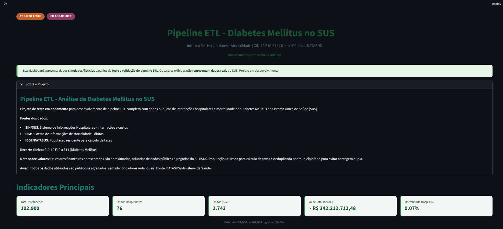
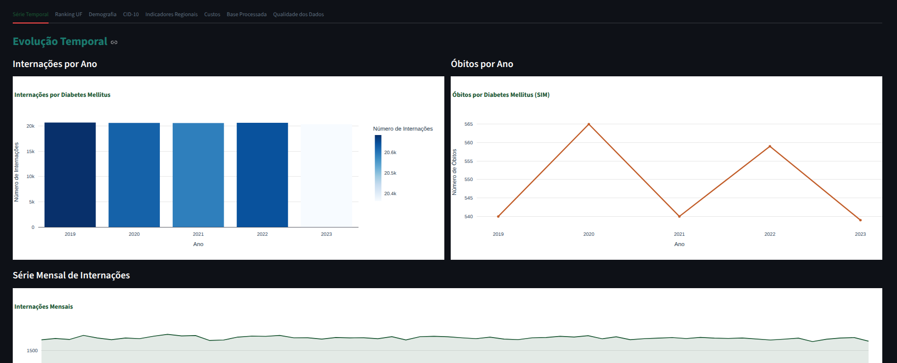
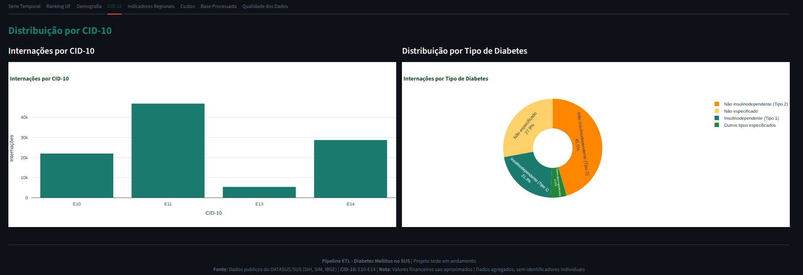
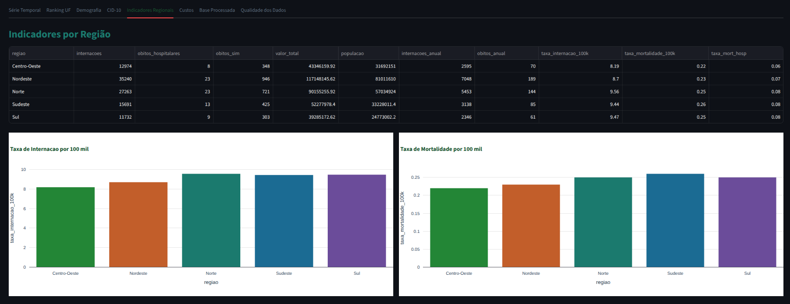
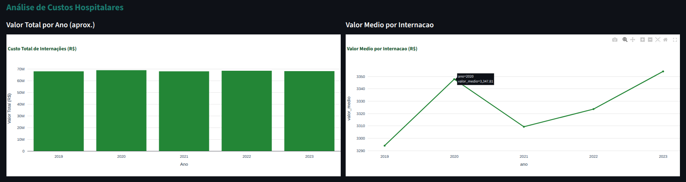
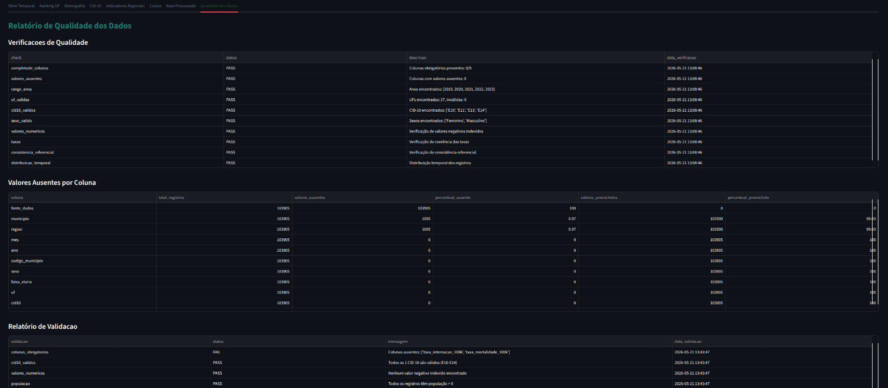

# SUS Diabetes ETL Pipeline



Pipeline ETL para análise de internações hospitalares e mortalidade por Diabetes Mellitus no SUS, utilizando dados públicos do DATASUS.

## Contextualização

Este projeto de Engenharia de Dados em Saúde Pública implementa um pipeline completo para coletar, tratar, padronizar, validar, integrar e visualizar dados públicos do SUS relacionados ao Diabetes Mellitus no Brasil, filtrando pelos códigos CID-10 **E10 a E14**.

### Fontes de Dados

| Fonte | Descrição |
|-------|-----------|
| **SIH/SUS** | Sistema de Informações Hospitalares - internações e custos |
| **SIM** | Sistema de Informações de Mortalidade - óbitos |
| **IBGE/DATASUS** | População residente para cálculo de taxas |

### Perguntas a serem Respondidas

- Como evoluíram as internações por Diabetes Mellitus no SUS?
- Quais estados e regiões apresentam mais internações?
- Qual é a distribuição por sexo e faixa etária?
- Qual é o custo total e médio das internações?
- Qual é a média de permanência hospitalar?
- Qual é a mortalidade hospitalar associada às internações?
- Como evoluíram os óbitos por Diabetes Mellitus?
- Quais estados têm maiores taxas por 100 mil habitantes?

## Estrutura do Projeto (Em evolução)

```
sus-diabetes-etl-pipeline/
├── README.md
├── requirements.txt
├── pyproject.toml
├── Makefile
├── .gitignore
│
├── data/
│   ├── raw/              # Dados brutos
│   ├── interim/          # Dados intermediários
│   ├── processed/        # Base final (CSV, Parquet, Excel)
│   └── reports/          # Relatórios de qualidade
│
├── notebooks/            # Análises exploratórias
│
├── src/
│   ├── config/           # Configurações centralizadas
│   ├── data/             # Módulos ETL (download, extract, transform, integrate, validate, load)
│   ├── indicators/       # Indicadores epidemiológicos
│   ├── quality/          # Verificações e relatórios de qualidade
│   ├── utils/            # Utilitários (logger, paths, normalização)
│   └── app/              # Aplicação Streamlit
│
├── tests/                # Testes automatizados (pytest)
│
├── logs/                 # Logs do pipeline
│
└── docs/                 # Documentação técnica
```

## Instalação

### Linux/macOS

```bash
python -m venv .venv
source .venv/bin/activate
pip install -r requirements.txt
```

### Windows

```bash
python -m venv .venv
.venv\Scripts\activate
pip install -r requirements.txt
```

## Uso

### 1. Download dos Dados

```bash
python -m src.data.download_datasus_data
```

Baixa dados do SIH, SIM e população do DATASUS. Caso os servidores não estejam disponíveis, gera dados sintéticos para demonstração.

### 2. Executar Pipeline ETL

```bash
python -m src.data.pipeline
```

Executa o pipeline completo: extração, transformação, integração, validação e exportação.

### 3. Executar Testes

```bash
pytest tests/ -v
```

### 4. Dashboard Interativo

```bash
streamlit run src/app/streamlit_app.py
```

### Usando Makefile

```bash
make setup       # Configura ambiente
make download    # Baixa dados
make run         # Executa pipeline
make test        # Executa testes
make streamlit   # Inicia dashboard
make all         # Executa tudo
```

## Base Final

A base processada contém as seguintes colunas:

| Coluna | Descrição |
|--------|-----------|
| `ano` | Ano de referência |
| `mes` | Mês (1-12) |
| `regiao` | Região geográfica |
| `uf` | Unidade da Federação |
| `municipio` | Nome do município |
| `codigo_municipio` | Código IBGE |
| `sexo` | Masculino/Feminino/Ignorado |
| `faixa_etaria` | Faixa etária |
| `cid10` | Código CID-10 |
| `tipo_diabetes` | Classificação do diabetes |
| `internacoes` | Total de internações |
| `valor_total` | Valor total (R$) |
| `valor_medio_internacao` | Valor médio (R$) |
| `dias_permanencia` | Dias de permanência |
| `media_permanencia` | Média permanência |
| `obitos_hospitalares` | Óbitos hospitalares |
| `taxa_mortalidade_hospitalar` | Mortalidade hospitalar (%) |
| `obitos_sim` | Óbitos (SIM) |
| `populacao` | População residente |
| `taxa_internacao_100k` | Internações por 100 mil |
| `taxa_mortalidade_100k` | Mortalidade por 100 mil |
| `fonte_dados` | Fonte dos dados |
| `data_extracao` | Data da extração |
| `data_processamento` | Data do processamento |

## Indicadores

- Total de internações e óbitos
- Valor total e médio das internações
- Média de permanência hospitalar
- Taxa de mortalidade hospitalar (%)
- Taxa de internação por 100 mil habitantes
- Taxa de mortalidade por 100 mil habitantes

#### Evolução Temporal



#### Distribuição por CID-10



#### Indicadores por Região



#### Análise de Custos Hospitalares



#### Relatório de Qualidade dos Dados



## Validações

O pipeline realiza validações de:
- Colunas obrigatórias presentes
- CID-10 restritos a E10-E14
- Valores numéricos sem negativos indevidos
- População maior que zero
- Anos no período analisado
- Duplicidades nas dimensões analíticas
- Ausência de identificadores individuais
- Coerência das taxas calculadas

## Docs

- [Dicionário de Dados](docs/data_dictionary.md)
- [Fontes DATASUS](docs/datasus_sources.md)
- [Documentação ETL](docs/etl_documentation.md)
- [Regras de Qualidade](docs/data_quality_rules.md)
- [Indicadores Epidemiológicos](docs/epidemiological_indicators.md)
- [Limitações](docs/limitations.md)

## Aviso

Todos os dados utilizados são **públicos e agregados**, sem identificadores individuais de pacientes. Fonte: DATASUS / Ministério da Saúde.

## Licença

MIT
